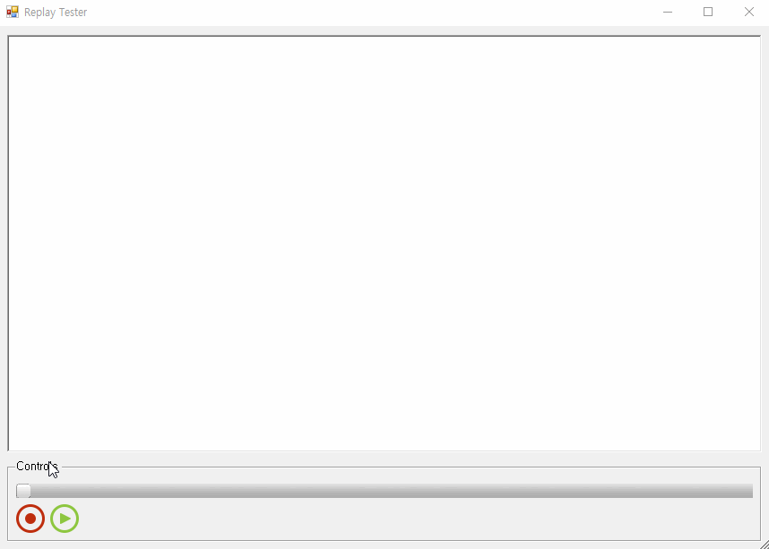

TextReplayer for Sharp
===================================
C# 기반 텍스트 되감기 프로그램 입니다. 사용자가 입력한 문자열을 레코딩 시킨 후,

슬라이드 바를 이용하여 각 시간대별 입력과정을 되감기 할 수 있는 기능을 구현 하였습니다.
## 주요 라이브러리
* 클라이언트
    * .NET Frameworks
    * .NET Frameworks Collections (Dictionary)

## 프로그램 사용 예제

